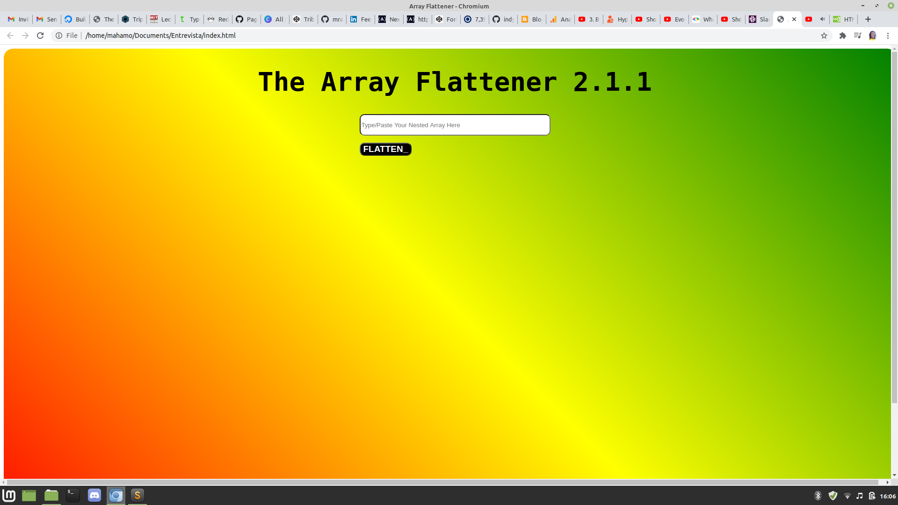
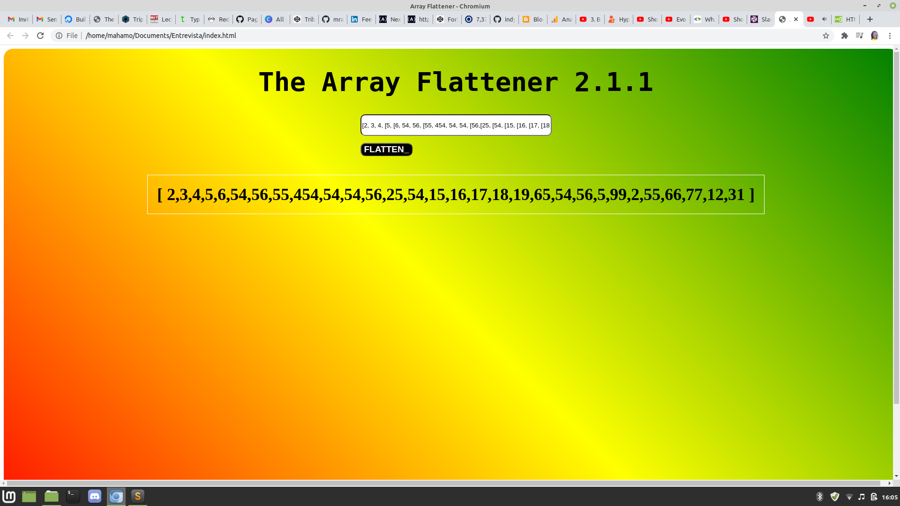

# The Array Flattener 2.1.1

### Functionality
* Flattens arbitrarily nested array of integers and returns result to user.
* For example, [5, [5, 6, 8, [1]]] will be flattened to [5, 5, 6, 8, 1]
* Simply paste or type array to be flattened and voila!

### UI 

#### author
Mahamo Ranoka 